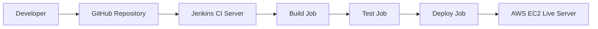
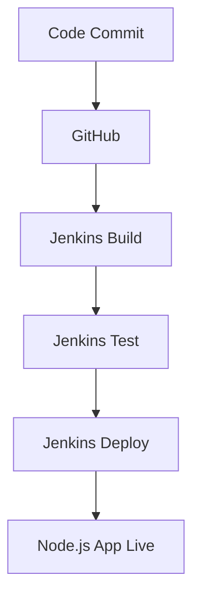
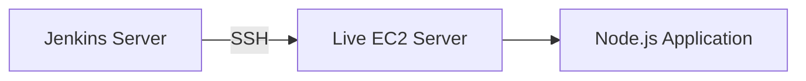

# 🚀 Jenkins CI/CD Pipeline for Node.js App Deployment on AWS EC2

> ## 🧑‍💻 Author Information
> **Author:** Sudarshan Bhosale  
> **Role:** Cloud & DevOps Engineer (Fresher – Hands-on Project)  
> **Skills:** AWS | Jenkins | CI/CD | Linux | Git | Node.js

---

## 📌 Project Overview
This project demonstrates a **complete CI/CD pipeline using Jenkins** to **build, test, and deploy a Node.js application** on an **AWS EC2 live server**.

The pipeline is implemented using **three separate Jenkins jobs**:
1. **NodeApp Build**
2. **NodeApp Test**
3. **NodeApp Deploy**

Source code is managed in **GitHub**, and deployment is done securely using **SSH credentials**.

---


## 🛠️ Technologies Used
- **AWS EC2 (Ubuntu)**
- **Jenkins**
- **Node.js & npm**
- **Git & GitHub**
- **SSH**
- **Linux**
- **PM2 / Node process manager**

---

## 🏗️ Infrastructure Setup

| Component | Description |
|---------|------------|
| Jenkins Server | AWS EC2 Ubuntu instance |
| Live Server | AWS EC2 Ubuntu instance |
| SCM | GitHub Repository |
| Automation Tool | Jenkins |
| Deployment Method | SSH |

---

## 🔗 GitHub Integration

- Jenkins jobs are configured with the **GitHub repository URL**
- **GitHub Webhook** is enabled for automatic build triggers
- Every **code commit** to the repository automatically triggers the **CI/CD pipeline**
- Ensures continuous integration and continuous deployment workflow

---

## 🔧 GitHub Webhook Integration

To enable automatic CI/CD triggers on code commits:

1. Go to your **GitHub repository → Settings → Webhooks**  
2. Click **Add webhook**  
3. Configure the webhook:
   - **Payload URL:** `http://<JENKINS_URL>/github-webhook/`
   - **Content type:** `application/json`
   - **Events:** Select **Just the push event**
4. Save the webhook  

✅ Now, every **push to GitHub** will automatically trigger your Jenkins pipeline

---


## 🔐 Jenkins Credentials Configuration
1. Go to **Jenkins Dashboard**
2. Navigate to **Manage Jenkins → Credentials**
3. Add:
   - **Kind:** SSH Username with private key
   - **Username:** ubuntu
   - **Private Key:** EC2 `.pem` key
   - **ID:** `ec2-ssh-key`

This credential is used in the **Deploy job**.

---


## 🔌 Required Plugins
Make sure the following Jenkins plugins are installed:

| Plugin Name                | Purpose                                         |
|-----------------------------|------------------------------------------------|
| Git Plugin                  | Pull code from GitHub                          |
| NodeJS Plugin               | Manage Node.js versions                        |
| SSH  Plugin            | Connect to remote servers using SSH           |
| Pipeline Plugin             | Create pipeline jobs using Jenkinsfile        |
| Credentials Binding Plugin  | Securely use credentials in jobs              |

---

## 🔐 Install SSH Plugin
1. Go to **Manage Jenkins**
2. Click **Manage Plugins**
3. Search **SSH**
4. Install & Restart Jenkins

---

## 🔐 SSH remote hosts

### 🛠️ Manage Jenkins → System → SSH Remote Shell (Save Steps)

This section explains how to configure **SSH Remote Host** settings in Jenkins so that Jenkins can execute shell commands on a remote EC2 server.

---

### 1️⃣ Open Jenkins System Configuration
1. Go to **Jenkins Dashboard**
2. Click **Manage Jenkins**
3. Select **System**

---

### 2️⃣ Locate “SSH Remote Hosts” / “SSH Remote Shell”
- Scroll down until you find **SSH Remote Hosts**  
  (This appears after installing the **SSH Plugin / SSH Agent Plugin**)


### 3️⃣ Add New SSH Remote Host
Click **Add SSH Remote Host** and fill in the following details:

| Field | Value |
|------|------|
| **Hostname** | `<LIVE SERVER_EC2_PUBLIC_IP>` |
| **Port** | `22` |
| **Credentials** | `ubuntu` |


### 4️⃣  Save Configuration
- Scroll to the bottom of the page
- Click **Save**

---


## ⚙️ Jenkins Configuration

- **Job Type:** Freestyle  
- **Source Code Management:** Git  

### 📦 Repository URL
```
     https://github.com/<your-username>/<jenkins-static-website-cicd.git>
```

### 🛠️ Build Step
- **Execute Shell**

---

## 🔄 Jenkins CI/CD Jobs Structure

### 🟢 Job 1: NodeApp-Build
**Purpose:** Install dependencies & build the application

**Steps:**
- Source Code Management-
    select git-
   past Repository URL
- Pull code from GitHub
- Install Node.js dependencies using `npm install`

**Build Command in build step-execute shell:**
```bash
npm install
```

---

### 🟡 Job 2: NodeApp-Test

**Purpose:** Run application test cases

**Steps:**
- Source Code Management-
   select git-
   past Repository URL
- Triggered automatically after the **NodeApp-Build** job
- Executes application test cases

**Test command in build step-execute shell:**
```bash
npm test
```
```
./node_modules/mocha/bin/_mocha --exit ./test/test.js
```

---

### 🔵 Job 3: NodeApp-Deploy

**Purpose:** Deploy Node.js application to Live EC2 Server

**Steps:**
- Triggered after successful **NodeApp-Test** job
- Uses Jenkins **SSH credentials**
- Copies application files to Live EC2 server
- Restarts Node.js application using **PM2**
- Build Steps-
      Execute shell script on remote host using ssh
**Deploy Commands:**
```bash
sudo apt  update
```
```
sleep 10
```
```
sudo apt install nodejs -y
```
```
sudo apt install npm -y
```
```
git clone https://github.com/Sudarshan-Bhosale145/devops-7-nodeapp.git
```
```
cd devops-7-nodeapp
```
```
npm install
```
```
sudo npm install -g pm2 -y
```
```
pm2 restart app.js || pm2 start app.js
```

  
- **🌐email-notification**
- **Post-build Actions**-
        E-mail Notification?-
         Recipients(email addtress)-
             click on(Send e-mail for every unstable build)


---

## 🌐 Live Server Configuration (Add Port 3000)

To access the Node.js application on the Live EC2 server:

1. Go to your **AWS EC2 Dashboard → Security Groups**  
2. Select the security group attached to your **Live EC2 instance**  
3. Edit **Inbound rules** and add a rule:
   - **Type:** Custom TCP
   - **Port Range:** `3000`
   - **Source:** `0.0.0.0/0` (or restrict to your IP for security)
4. Save the changes  

✅ This allows external access to your Node.js application running on **port 3000**

---

## 🧪 Validation

### 🌐 Access your website
---
http://<WEB_SERVER_PUBLIC_IP:3000>
---

✔ Loads Successfully  


---


## 🔗 Jenkins Pipeline Overview

- **Build → Test → Deploy** sequence for Node.js application  
- **Automatic triggers** via GitHub webhooks on every commit  
- **Secure deployment** using Jenkins stored SSH credentials  
- **Scalable pipeline:** Easily add additional jobs or environments
  
---


  ## 🏛️ High-Level Architecture Diagram



---


## 🔁 CI/CD Pipeline Flow Diagram



---

## 🧩 SSH-Based Deployment Architecture



---

## 📂 Project Directory Structure

```text
nodeapp/
│── app.js
│── package.json
│── test/test.js
│── README.md

```

---

## ✅ Final Outcome

✔ Automated **build, test, and deployment** process  
✔ Secure **SSH-based deployment** to Live EC2 server  
✔ Scalable and reliable **CI/CD pipeline** using Jenkins  
✔ Real-time **Node.js application deployment** on AWS EC2  

---

## 🚀 Deployment Location

The Node.js application is deployed on an **AWS EC2 Ubuntu server** and served to users via HTTP (port 80) or HTTPS (port 443, optional).  

### ✅ Live Server Details
| Component           | Details |
|--------------------|---------|
| Cloud Provider      | AWS |
| Instance Type       | t2.micro / t3.medium (as per project) |
| OS                  | Ubuntu 22.04 LTS |
| Node.js Port        | 3000 (application) |
| HTTP Port           | 80 (public website) |
| HTTPS Port (optional)| 443 (secure website) |
| SSH Access          | Port 22, restricted to Jenkins server |

### 🌐 Access Details
- **Website URL:** `http://<LIVE_SERVER_PUBLIC_IP>`  
- **SSH Login:** `ssh -i <your-key.pem> ubuntu@<LIVE_SERVER_PUBLIC_IP>`  

### 💡 Notes
- Node.js runs on port **3000**, but traffic is usually routed through **Nginx reverse proxy** on port 80/443 for production.  
- Security groups are configured to **restrict SSH** and **allow only required ports** for public access.  
- Deployment is fully automated via Jenkins **Build → Test → Deploy** pipeline.  

---

## 🎯 Why This Project Is Important
This project demonstrates the **end-to-end implementation of a CI/CD pipeline** using Jenkins for a Node.js application deployed on AWS EC2. It reflects real-world DevOps workflows by automating code integration, testing, and deployment.

- 🔹 Automates the software delivery process, reducing manual effort and errors  
- 🔹 Implements industry-standard tools like **GitHub, Jenkins, and AWS EC2**  
- 🔹 Shows clear separation of **Build, Test, and Deploy** stages  
- 🔹 Ensures faster and more reliable application releases  
- 🔹 Demonstrates secure deployment using **SSH credentials**  
- 🔹 Strengthens practical DevOps skills and real-time production understanding  

---

## 🚀 Future Enhancements
The following improvements can be implemented to make the CI/CD pipeline more robust, scalable, and production-ready:

- 🔹 **Pipeline as Code (Jenkinsfile)**  
  Convert freestyle Jenkins jobs into a declarative Jenkins pipeline using a `Jenkinsfile`.

- 🔹 **Docker Integration**  
  Containerize the Node.js application using Docker for consistent builds and deployments.

- 🔹 **Kubernetes Deployment**  
  Deploy the application on Kubernetes (EKS) for high availability and auto-scaling.

- 🔹 **Automated Rollback Strategy**  
  Implement rollback mechanisms in case deployment fails.

- 🔹 **Monitoring & Logging**  
  Integrate monitoring tools like **Prometheus & Grafana** and logging using **ELK Stack**.

- 🔹 **Security Enhancements**  
  Add vulnerability scanning using tools like **Trivy**, **SonarQube**, or **OWASP Dependency Check**.

- 🔹 **Blue-Green / Canary Deployment**  
  Implement advanced deployment strategies to minimize downtime.

- 🔹 **Environment Separation**  
  Add multiple environments such as **Dev, QA, Staging, and Production**.

- 🔹 **Infrastructure as Code (IaC)**  
  Use **Terraform or AWS CloudFormation** to automate infrastructure provisioning.

---


## 👨‍💻 About Me

**Sudarshan Bhosale**  
Cloud & DevOps Engineer (Fresher)  
Learning **CI/CD | Cloud | Automation | DevOps Tools**

---

## 🌐 Connect With Me

- 🔗 [LinkedIn](https://www.linkedin.com/in/sudarshan-bhosale-174477374)
- 🔗 [GitHub](https://github.com/Sudarshan-Bhosale145)

---

## ⭐ Support

If you like this project, don’t forget to **star ⭐ the repository**.  
Feel free to **fork** the repo and enhance it with new features or improvements!

---
